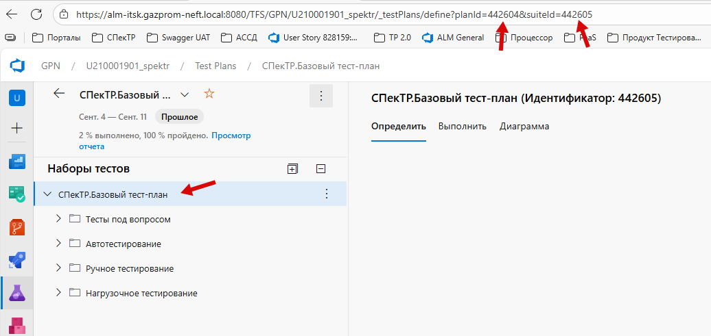
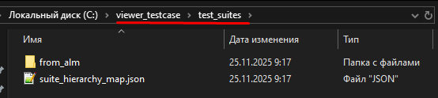

# Инструкция по импорту тест-кейсов из ALM

## Обзор

Данная инструкция описывает процесс импорта тест-кейсов из Azure DevOps Test Plans (ALM) в систему просмотра тест-кейсов.

## Предварительные требования

### Настройка структуры в КСПД

**Важно:** Перед началом импорта необходимо настроить структуру тест-кейсов в КСПД:

- Должна быть **одна главная папка**, в которой находятся подпапки
- В **главной папке не должно быть тест-кейсов** (только подпапки)

Пример правильной структуры:




---

## Шаг 1: Получение списка всех suites

### Выполнение запроса через Postman

1. Откройте **Postman** (или другой инструмент для работы с API)

2. Создайте **GET** запрос:
   ```
   https://alm-itsk.gazprom-neft.local:8080/TFS/GPN/U210001901_spektr/_apis/testplan/Plans/442604/Suites
   ```

3. Настройте авторизацию:
   - Тип: **Basic Authentication**
   - Для генерации токена:
     - Откройте настройки профиля в ALM
     - Сгенерируйте токен (аналогично настройке для ALMReporter)

4. Выполните запрос

5. Сохраните результат:
   - В Postman: нажмите **"Save Response"** (справа внизу)

<div style="background-color: #fff3cd; border-left: 4px solid #ffc107; padding: 12px; margin: 16px 0; border-radius: 4px;">

⚠️ **КРИТИЧЕСКИ ВАЖНО!**

**ОБЯЗАТЕЛЬНО переименуйте сохраненный файл в `all_suites.json`**

Без правильного имени файла последующие скрипты не смогут найти данные и процесс импорта не будет работать!

</div>

### Результат

- Файл `all_suites.json` с данными о всех suites

---

## Шаг 2: Получение тест-кейсов для всех suites

### Подготовка файлов

Перенесите в КСПД папку `import_alm`

### Настройка

1. Откройте файл `import_alm/const.py`
2. Настройте переменные

### Выполнение

Запустите скрипт:

```bash
python run_import.py
```

### Результат

В папке со скриптом будут сгенерированы файлы:
- `from_alm/` - папка, в которой будут сохранены тест-кейсы в формате `{suite_id}.json` (например, `12345.json`)
- `suite_hierarchy_map.json` - карта иерархии тест-кейсов

---

## Шаг 3: Перенос файлов в систему просмотра
1. Перенесите файлы в devzone (папку `from_alm/` и `suite_hierarchy_map.json`)
2. Скопируйте эти файлы в папку `test_suites/from_alm/`

Пример правильной структуры:




## Шаг 4: Импорт в систему просмотра

1. Запустите приложение просмотра тест-кейсов

2. В меню выберите: **Файл → Импорт из ALM**

3. Дождитесь завершения импорта
